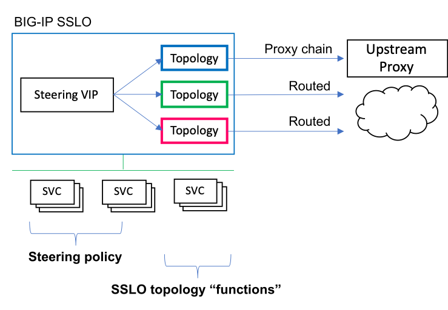
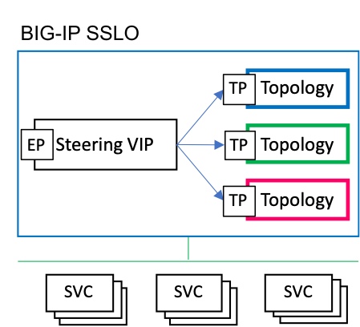
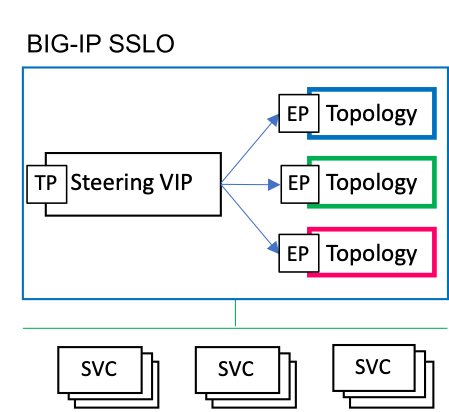

# F5 SSL Orchestrator Layered Architecture Configuration
A set of iRules for creating a layered SSL Orchestrator, to reduce complexity by treating topologies as functions.

### Current version:
2.2

### Version support
This utility works on BIG-IP 14.1 and above, SSL Orchestrator 5.x to 9.x.

### Description:
The SSL Orchestrator Internal Layered Architecture pattern is designed to both simplify configuration and management, and expand the capabilities of an SSL Orchestrator deployment. Too often these configurations can get complex, where large security policies or multiple topologies are required to satisfy different diverse traffic pattern needs. Or, a configuration may require non-strict changes that later make management and upgrades challenging. Consider however, that across multiple security rules and multiple topologies, there are basically FOUR actions that are performed for any traffic pattern:

  - Allow / block
  - TLS intercept / bypass
  - Service chain assignment
  - Egress path

The Internal Layered Architecture pattern simplifies the architecture by reducing a topology to a single "function" as a combination of these FOUR actions, and pushing policy steering to a frontend virtual server.

This pattern has the following additional advantages:

  - The steering policy runs on a pure BIG-IP LTM virtual server, so is infinitely flexible and automatable.
  - Topology functions are simplified and require no or minimal customization.
  - Topology objects are re-usable (ex. SSL configurations, services), further reducing object counts.
  - Topology functions support an additional "dynamic egress" pattern, where different egress setting can be selected per topology.
  - Topology functions support more flexible bypass options.
  - Topology functions support more flexible automation and management.

This repo is dedicated to a set of tooling to make this architecture pattern easier to implement and manage, including a library iRule that greatly simplifies traffic matching and steering.

### How to install 
While the Internal Layered Architecture can be used in any direction, it is most useful in a forward proxy scenario. The following specifically addresses layer 3 forward proxy use cases, but it is also possible to do in a layer 2 "vwire" configuration. Within the layer 3 forward proxy scenarios, there are three sub-options:

  - Transparent forward proxy
  - Explicit forward proxy (proxy in front)
  - Explicit forward proxy (proxy in back)

--------------------------------------------------

#### Transparent Forward Proxy
In a transparent forward proxy, the steering VIP and SSL Orchestrator topologies are all configured as transparent forward proxy, and the steering VIP simply forwards traffic based on a traffic match to a specific internal topology function. Under the **transparent-proxy** subfolder are two iRules. The **SSLOLIB** iRule is a library rule, and the **sslo-layering-rule** is the iRule that's applied to the steering VIP and calls the library iRule functions.

- **Step 1**: Import this SSLOLIB iRule (name it "SSLOLIB")

- **Step 2**: Build a set of "dummy" VLANs. A topology must be bound to a unique VLAN. But since the topologies in this architecture won't be listening on an actual client-facing VLAN, you will need to create a separate dummy VLAN for each topology you intend to create. A dummy VLAN is basically a VLAN with no interface assigned. In the BIG-IP UI, under Network -> VLANs, click Create. Give your VLAN a name and click Finished. It will ask you to confirm since you're not attaching an interface. Click OK to continue. Repeat this step by creating unique VLAN names for each topology you are planning to use.

- **Step 3**: Build semi-static SSL Orchestrator topologies based on common actions (ex. allow, intercept, service chain, egress)
  - Minimally create a normal "intercept" topology and a separate "bypass" topology:
  
    Intercept topology:
      - L3 outbound topology configuration, normal topology settings, SSL config, services, service chain
      - No security policy rules - just a single ALL rule with TLS intercept action (and service chain)
      - Attach to a "dummy" VLAN

    Bypass topology:
      - L3 outbound topology configuration, skip SSL config, re-use services, service chains
      - No security policy rules - just a single ALL rule with TLS bypass action (and service chain)
      - Attached to a separate "dummy" VLAN

  - Create any additional topologies as required, as separate functions based on discrete actions (allow/block, intercept/bypass, service chain, egress)

- **Step 4**: Import the traffic switching iRule
  - Set necessary static configuration values in RULE_INIT as required
  - Define any URL category lists in RULE_INIT as required (see example). Use the following command to get a list of URL categories:

    `tmsh list sys url-db url-category |grep "sys url-db url-category " |awk -F" " '{print $4}'`

- **Step 5**: Create a client-facing topology switching VIP
  - Type: Standard
  - Source: 0.0.0.0/0
  - Destination: 0.0.0.0/0:0
  - Protocol: TCP
  - VLAN: client-facing VLAN
  - Address Translation: disabled
  - Port Translation: disabled
  - Default Persistence Profile: ssl
  - iRule: traffic switching iRule

- **Step 6**: modify the traffic switching iRule with the required detection commands. See **Traffic Selector commands - Transparent Proxy** information below.

--------------------------------------------------

#### Explicit Forward Proxy (proxy in front)
In this scenario, an explicit proxy configuration is built up front at the steering layer. A BIG-IP LTM explicit proxy consists of a DNS resolver, TCP tunnel, HTTP explicit profile, an HTTP explicit proxy virtual server, and a separate TCP tunnel virtual server. Traffic flows from the client to the HTTP explicit proxy VIP and is tunneled through the TCP tunnel VIP. Therefore to configure the explicit proxy for the Internal Layered Architecture, simply apply the layering iRule to the TCP tunnel VIP, which will behave exactly the same way as the transparent proxy implementation. This will use the same iRules under the **transparent-proxy** subfolder.

*Note: to perform explicit proxy authentication, an SWG-Explicit access profile would be applied to the frontend explicit proxy configuration.*

- **Step 1**: Create the DNS Resolver for the HTTP explicit config. Under Network -> DNS Resolvers -> DNS Resolver List, click **Create** provide a unique name and click **Finished**. Now click to edit this new DNS resolver and navigate to the Forward Zones tab and click **Add**. 
  - Name: enter "." (without quotation marks)
  - Address: enter the address of your preferred DNS resolver
  - Service Port: enter the listening port of the DNS resolver
  - Click **Add** and then **Finished**.

- **Step 2**: Create the TCP Tunnel for the HTTP explicit config. Under Network -> Tunnels -> Tunnel List, click **Create**. 
  - Name: provide a unique name
  - Profile: tcp-forward
  - Click **Finished**

- **Step 3**: Create the HTTP explicit profile. Under Local Traffic -> Profiles -> Services -> HTTP, click **Create**.
  - Name: provide a unique name
  - Proxy Mode: select Explicit
  - Explicit Proxy : DNS Resolver: enable and select the previously-created DNS resolver
  - Explicit Proxy : Tunnel Name: enable and select the previously-create TCP tunnel
  - Optionally add content to the Explicit Proxy failure messages
  - Click **Finished**

- **Step 4**: Create the TCP Tunnel VIP. Under Local Traffic -> Virtual Servers, click **Create**.
  - Name: provide a unique name
  - Source Address: enter 0.0.0.0/0
  - Destination Address/Mask: enter 0.0.0.0/0
  - Service Port: enter *
  - Configuration : VLAN and Tunnel Traffic: select **Enabled on...** and select the previously-created TCP tunnel
  - Address Translation: disabled
  - Port Translation: disabled
  - Default Persistence Profile: ssl
  - Click **Finished**

- **Step 5**: Create a tunneling iRule. The tunneling iRule is used on the HTTP explicit VIP to ensure unencrypted HTTP proxy requests also flow through the TCP tunnel. Under Local Traffic -> iRules, click **Create**
    
      when HTTP_REQUEST {
         virtual "/Common/tcp-tunnel-vip" [HTTP::proxy addr] [HTTP::proxy port]
      }

  Change "/Common/tcp-tunnel-vip" to match the name of the TCP tunnel virtual server.

- **Step 6**: Create the HTTP explicit proxy VIP. Under Local Traffic -> Virtual Servers, click **Create**.
  - Name: provide a unique name
  - Source Address: enter 0.0.0.0/0
  - Destination Address/Mask: enter the explicit proxy listening IP address (what clients will be configured to talk to)
  - Service Port: enter the explicit proxy listening port (ex. 3128, 8080)
  - Configuration : HTTP Profile (Client): enter the previously-created HTTP explicit profile
  - Configuration : VLAN and Tunnel Traffic: select **Enabled on...** and select the client-facing VLAN
  - Address Translation: enabled
  - Port Translation: enabled
  - iRules: select the previously-created tunneling iRule
  - Click **Finished**

- **Step 7**: Import this SSLOLIB iRule (name "SSLOLIB")

- **Step 8**: Build a set of "dummy" VLANs. A topology must be bound to a unique VLAN. But since the topologies in this architecture won't be listening on an actual client-facing VLAN, you will need to create a separate dummy VLAN for each topology you intend to create. A dummy VLAN is basically a VLAN with no interface assigned. In the BIG-IP UI, under Network -> VLANs, click Create. Give your VLAN a name and click Finished. It will ask you to confirm since you're not attaching an interface. Click OK to continue. Repeat this step by creating unique VLAN names for each topology you are planning to use.

- **Step 9**: Build semi-static SSL Orchestrator topologies based on common actions (ex. allow, intercept, service chain)
  - Minimally create a normal "intercept" topology and a separate "bypass" topology
  
    Intercept topology:
      - L3 outbound topology configuration, normal topology settings, SSL config, services, service chain
      - No security policy rules - just a single ALL rule with TLS intercept action (and service chain)
      - Attach to a "dummy" VLAN

    Bypass topology:
      - L3 outbound topology configuration, skip SSL config, re-use services, service chains
      - No security policy rules - just a single ALL rule with TLS bypass action (and service chain)
      - Attached to a separate "dummy" VLAN

  - Create any additional topologies as required, as separate functions based on discrete actions (allow/block, intercept/bypass, service chain, egress)

- **Step 10**: Import the traffic switching iRule
  - Set necessary static configuration values in RULE_INIT as required
  - Define any URL category lists in RULE_INIT as required (see example). Use the following command to get a list of URL categories:

    `tmsh list sys url-db url-category |grep "sys url-db url-category " |awk -F" " '{print $4}'`

- **Step 11**: Add the traffic switching iRule to the TCP tunnel virtual server.

- **Step 12**: modify the traffic switching iRule with the required detection commands. See **Traffic Selector commands - Transparent Proxy** information below.

--------------------------------------------------

#### Explicit Forward Proxy (proxy in back)
In this scenario, an explicit proxy configuration is built at each topology instance, and the frontend steering layer is a simple forwarder. The steering policy is a bit different in this case as the frontend will be observing explicit proxy requests instead of TLS SNI traffic. This difference is captured under the **explicit-proxy** subfolder. The **SSLOLIBEXP** iRule is the library rule, and the **sslo-layering-exp-rule** is applied to the frontend forwarder.

*Note: to perform explicit proxy authentication, an SWG-Explicit access profile would be applied to each of the backend explicit proxy topologies. This pattern provides an additional advantage of adding authentication enabled/disabled actions based on steering policy.*

- **Step 1**: Import this SSLOLIBEXP iRule (name it "SSLOLIBEXP")

- **Step 2**: Build a set of "dummy" VLANs. A topology must be bound to a unique VLAN. But since the topologies in this architecture won't be listening on an actual client-facing VLAN, you will need to create a separate dummy VLAN for each topology you intend to create. A dummy VLAN is basically a VLAN with no interface assigned. In the BIG-IP UI, under Network -> VLANs, click Create. Give your VLAN a name and click Finished. It will ask you to confirm since you're not attaching an interface. Click OK to continue. Repeat this step by creating unique VLAN names for each topology you are planning to use.

- **Step 3**: Build semi-static SSL Orchestrator explicit proxy topologies based on common actions (ex. allow, intercept, service chain, egress).
  - Minimally create a normal "intercept" topology and a separate "bypass" topology:
  
    Intercept topology:
      - L3 explicit proxy topology configuration, normal topology settings, SSL config, services, service chain
      - No security policy rules - just a single ALL rule with TLS intercept action (and service chain)
      - Attach to a "dummy" VLAN

    Bypass topology:
      - L3 explicit proxy topology configuration, skip SSL config, re-use services, service chains
      - No security policy rules - just a single ALL rule with TLS bypass action (and service chain)
      - Attached to a separate "dummy" VLAN

  - Create any additional explicit proxy topologies as required, as separate functions based on discrete actions (allow/block, intercept/bypass, service chain, egress)

- **Step 4**: Import the traffic switching iRule
  - Set necessary static configuration values in RULE_INIT as required
  - Define any URL category lists in RULE_INIT as required (see example). Use the following command to get a list of URL categories:

    `tmsh list sys url-db url-category |grep "sys url-db url-category " |awk -F" " '{print $4}'`

- **Step 5**: Create a client-facing topology switching VIP
  - Type: Standard
  - Source: 0.0.0.0/0
  - Destination: enter the client-facing explicit proxy IP (what the client will be configured to talk to)
  - Service Port: enter the explicit proxy listening port. This must be the same as the listening port defined in the topologies (ex. 3128, 8080).
  - Configuration : HTTP Profile (client): select the "sslo-default-http-explicit" profile
  - Configuration : VLAN and Tunnel Traffic: select **Enabled on...** and select the client-facing VLAN
  - Configuration : Address Translation: disabled
  - Configuration : Port Translation: disabled
  - iRule: traffic switching iRule

- **Step 6**: modify the traffic switching iRule with the required detection commands. See **Traffic Selector commands - Explicit Proxy** information below.

--------------------------------------------------

### Traffic selector commands - Transparent Proxy (to be used in traffic switching iRule)
- Call the "target" proc with the following parameters ([topology name], ${sni}, [message])
  - **[topology name]** is the base name of the defined topology
  - **${sni}** is static here and returns the server name indication value (SNI) for logging
  - **[message]** is any string message to send to the log (ex. which rule matched)
  - **return** is added at the end of each command to cancel any further matching
  - Example: 
    `call SSLOLIB::target "bypass" ${sni} "SRCIP"`

- Use the following commands to query the proc function for matches (all return true or false)
    The following commands run in CLIENTSSL_CLIENTHELLO to act on SSL traffic.

      Source IP Detection (static IP, IP subnet, data group match)
         SRCIP IP:<ip/subnet>
         SRCIP DG:<data group name> (address-type data group)
         if { [call SSLOLIB::SRCIP IP:10.1.0.0/16] } { call SSLOLIB::target "topology name" ${sni} "SRCIP" ; return }
         if { [call SSLOLIB::SRCIP DG:my_sip_list] } { call SSLOLIB::target "topology name" ${sni} "SRCIP" ; return }
 
      Source Port Detection (static port, port range, data group match)
         SRCPORT PORT:<port/port-range>
         SRCPORT DG:<data group name> (integer-type data group)
         if { [call SSLOLIB::SRCPORT PORT:15000] } { call SSLOLIB::target "topology name" ${sni} "SRCPORT" ; return }
         if { [call SSLOLIB::SRCPORT PORT:1000-60000] } { call SSLOLIB::target "topology name" ${sni} "SRCPORT" ; return }
         if { [call SSLOLIB::SRCPORT DG:my-sport-list] } { call SSLOLIB::target "topology name" ${sni} "SRCPORT" ; return }
 
      Destination IP Detection (static IP, IP subnet, data group match)
         DSTIP IP:<ip/subnet>
         DSTIP DG:<data group name> (address-type data group)
         if { [call SSLOLIB::DSTIP IP:93.184.216.34] } { call SSLOLIB::target "topology name" ${sni} "DSTIP" ; return }
         if { [call SSLOLIB::DSTIP DG:my-dip-list] } { call SSLOLIB::target "topology name" ${sni} "DSTIP" ; return }
 
      Destination Port Detection (static port, port range, data group match)
         DSTPORT PORT:<port/port-range>
         DSTPORT DG:<data group name> (integer-type data group)
         if { [call SSLOLIB::DSTPORT PORT:443] } { call SSLOLIB::target "topology name" ${sni} "DSTPORT" ; return }
         if { [call SSLOLIB::DSTPORT PORT:1-1024] } { call SSLOLIB::target "topology name" ${sni} "DSTPORT" ; return }
         if { [call SSLOLIB::DSTPORT DG:my-dport-list] } { call SSLOLIB::target "topology name" ${sni} "DSTPORT" ; return }

      SNI Detection (static URL, category match, data group match)
         SNI URL:<static url>
         SNI URLGLOB:<static url> (ends_with match)
         if { [call SSLOLIB::SNI URL:www.example.com] } { call SSLOLIB::target "topology name" ${sni} "SNIURL" ; return }
         if { [call SSLOLIB::SNI URLGLOB:.example.com] } { call SSLOLIB::target "topology name" ${sni} "SNIURLGLOB" ; return }

         SNI CAT:<category name or list of categories>
         if { [call SSLOLIB::SNI CAT:/Common/Financial_Data_and_Services] } { call SSLOLIB::target "topology name" ${sni} "SNICAT" ; return }
         if { [call SSLOLIB::SNI CAT:$static::URLCAT_Finance_Health] } { call SSLOLIB::target "topology name" ${sni} "SNICAT" ; return }
    
         SNI DG:<data group name> (string-type data group)
         SNI DGGLOB:<data group name> (ends_with match)
         if { [call SSLOLIB::SNI DG:my-sni-list] } { call SSLOLIB::target "topology name" ${sni} "SNIDG" ; return }
         if { [call SSLOLIB::SNI DGGLOB:my-sniglob-list] } { call SSLOLIB::target "topology name" ${sni} "SNIDGGLOB" ; return }

      Combinations: above selectors can be used in combinations as required. Example:
         if { ([call SSLOLIB::SRCIP IP:10.1.0.0/16]) and ([call SSLOLIB::DSTIP IP:93.184.216.34]) }

 
- It is also possible to add an HTTP_REQUEST event and client HTTP profile to act on the HTTP Host header of unencrypted HTTP requests. Note that by default ay non-TLS traffic will flow to the specified default topology. By adding a client HTTP profile and any of the following in the HTTP_REQUEST event, you can trigger policy steering on unencrypted HTTP traffic.
 
      HOST Detection (static URL, category match, data group match)
         HOST URL:<static url>
         HOST URLGLOB:<static url> (ends_with match)
         if { [call SSLOLIB::HOST URL:www.example.com] } { call SSLOLIB::target "topology name" ${host} "HOSTURL" ; return }
         if { [call SSLOLIB::HOST URLGLOB:.example.com] } { call SSLOLIB::target "topology name" ${host} "HOSTURLGLOB" ; return }

         HOST CAT:<category name or list of categories>
         if { [call SSLOLIB::HOST CAT:/Common/Financial_Data_and_Services] } { call SSLOLIB::target "topology name" ${host} "HOSTCAT" ; return }
         if { [call SSLOLIB::HOST CAT:$static::URLCAT_Finance_Health] } { call SSLOLIB::target "topology name" ${host} "HOSTCAT" ; return }
    
         HOST DG:<data group name> (string-type data group)
         HOST DGGLOB:<data group name> (ends_with match)
         if { [call SSLOLIB::HOST DG:my-sni-list] } { call SSLOLIB::target "topology name" ${host} "HOSTDG" ; return }
         if { [call SSLOLIB::HOST DGGLOB:my-sniglob-list] } { call SSLOLIB::target "topology name" ${host} "HOSTDGGLOB" ; return }

--------------------------------------------------

### Traffic selector commands - Explicit Proxy (to be used in traffic switching iRule)
- Call the "target" proc with the following parameters ([topology name], ${sni}, [message])
  - **[topology name]** is the base name of the defined topology
  - **${host}** is static here and returns the server name indication value (SNI) for logging
  - **[message]** is any string message to send to the log (ex. which rule matched)
  - **return** is added at the end of each command to cancel any further matching
  - Example: 
    `call SSLOLIBEXP::target "bypass" ${host} "SRCIP"`

- Use the following commands to query the proc function for matches (all return true or false)
    All commands run in HTTP_PROXY_REQUEST to act on explicit proxy requests.

      Source IP Detection (static IP, IP subnet, data group match)
         SRCIP IP:<ip/subnet>
         SRCIP DG:<data group name> (address-type data group)
         if { [call SSLOLIBEXP::SRCIP IP:10.1.0.0/16] } { call SSLOLIBEXP::target "topology name" ${host} "SRCIP" ; return }
         if { [call SSLOLIBEXP::SRCIP DG:my_sip_list] } { call SSLOLIBEXP::target "topology name" ${host} "SRCIP" ; return }
 
      Source Port Detection (static port, port range, data group match)
         SRCPORT PORT:<port/port-range>
         SRCPORT DG:<data group name> (integer-type data group)
         if { [call SSLOLIBEXP::SRCPORT PORT:15000] } { call SSLOLIBEXP::target "topology name" ${host} "SRCPORT" ; return }
         if { [call SSLOLIBEXP::SRCPORT PORT:1000-60000] } { call SSLOLIBEXP::target "topology name" ${host} "SRCPORT" ; return }
         if { [call SSLOLIBEXP::SRCPORT DG:my-sport-list] } { call SSLOLIBEXP::target "topology name" ${host} "SRCPORT" ; return }
 
      Destination IP Detection (static IP, IP subnet, data group match)
         DSTIP IP:<ip/subnet>
         DSTIP DG:<data group name> (address-type data group)
         if { [call SSLOLIBEXP::DSTIP IP:93.184.216.34] } { call SSLOLIBEXP::target "topology name" ${host} "DSTIP" ; return }
         if { [call SSLOLIBEXP::DSTIP DG:my-dip-list] } { call SSLOLIBEXP::target "topology name" ${host} "DSTIP" ; return }

      HOST Detection (static URL, category match, data group match)
         HOST URL:<static url>
         HOST URLGLOB:<static url> (ends_with match)
         if { [call SSLOLIBEXP::HOST URL:www.example.com] } { call SSLOLIBEXP::target "topology name" ${host} "HOSTURL" ; return }
         if { [call SSLOLIBEXP::HOST URLGLOB:.example.com] } { call SSLOLIBEXP::target "topology name" ${host} "HOSTURLGLOB" ; return }

         HOST CAT:<category name or list of categories>
         if { [call SSLOLIBEXP::HOST CAT:/Common/Financial_Data_and_Services] } { call SSLOLIBEXP::target "topology name" ${host} "HOSTCAT" ; return }
         if { [call SSLOLIBEXP::HOST CAT:$static::URLCAT_Finance_Health] } { call SSLOLIBEXP::target "topology name" ${host} "HOSTCAT" ; return }
    
         HOST DG:<data group name> (string-type data group)
         HOST DGGLOB:<data group name> (ends_with match)
         if { [call SSLOLIBEXP::HOST DG:my-sni-list] } { call SSLOLIBEXP::target "topology name" ${host} "HOSTDG" ; return }
         if { [call SSLOLIBEXP::HOST DGGLOB:my-sniglob-list] } { call SSLOLIBEXP::target "topology name" ${host} "HOSTDGGLOB" ; return }

      Combinations: above selectors can be used in combinations as required. Example:
         if { ([call SSLOLIBEXP::SRCIP IP:10.1.0.0/16]) and ([call SSLOLIBEXP::DSTIP IP:93.184.216.34]) }
