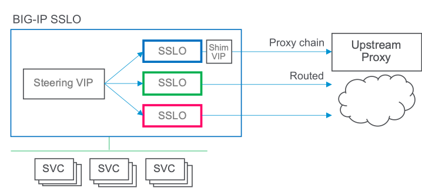

# F5 SSL Orchestrator Layered Architecture Configuration
# Transparent Proxy Configuration Use Cases
This section defines use cases specific to a transparent forward proxy implementation using the layered architecture

## Transparent to Explicit Proxy Egress:
In this scenario, clients egress through a transparent proxy solution but may need some traffic leaving SSL Orchestrator to flow through an upstream explicit proxy gateway. This requires special handling to convert the outbound routed traffic to an explicit proxy flow. The steps are as follows:

- Create a "client" iRule that will be attached to an SSL Orchestrator topology. This iRule will override normal outbound routing and force traffic to a "shim" virtual server.
- Create a "server" iRule that will attached to the shim virtual server. This iRule will handle the conversion of encrypted routed traffic to an explicit proxy communication.
- Create a "shim" virtual server that will sit between an SSL Orchestrator egress path and the upstream explicit proxy.

