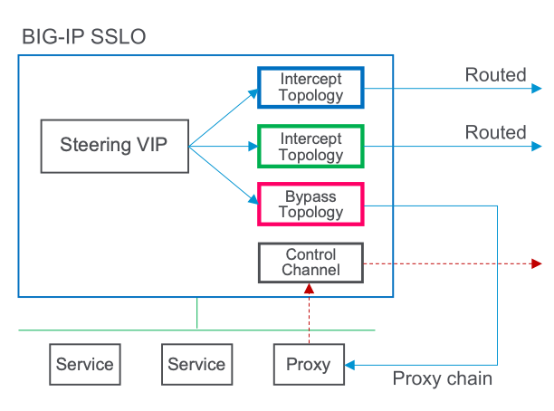

# F5 SSL Orchestrator Layered Architecture Configuration
# Transparent Proxy Configuration Use Cases
This section defines use cases specific to a transparent forward proxy implementation using the layered architecture

## Encrypted Traffic to an HTTP Proxy Service:
SSL Orchestrator employs "flow signaling" to maintain traffic context through the dynamic service chain. As a flow leaves the BIG-IP for an inline security service, its flow information is recorded (src+dst IP:port) so that when it returns from the service, context can be re-established. An inline HTTP proxy service, however, will always minimally change the source port, thus breaking the flow signal. For this reason, and to support HTTP proxy services in the dynamic service chain, SSL Orchestrator uses an HTTP header signal through this device type. This also requires that signaling through a proxy service can only happen for unencrypted/decrypted HTTP traffic. As an HTTP header cannot be injected into TLS bypassed connections, SSL Orchestrator will bypass any proxy service in the service chain for TLS bypassed traffic. 

If at all possible, configure the HTTP proxy security service as a transparent proxy device to alleviate complexity. In this case, the egress loop to this service is a simple routed path. The below guidance is **ONLY** needed if the HTTP proxy service must be in explicit proxy mode. There is no direct support for SSL Orchestrator in transparent proxy mode to egress to an explicit proxy, so this use case consolidates the "explicit proxy egress" use case (detailed separately) to build a "shim" to convert egress routed traffic to an explicit proxy connection. TLS bypass topology traffic has a "client" iRule attached that overrides the normal egress routing mechanism and VIP targets the re-encrypted traffic to a "shim" virtual server. This shim VIP has a "server" iRule that converts the routed traffic to an explicit proxy connection, which then directs that traffic back to the HTTP proxy security service inside the SSL Orchestrator service chain. Traffic leaving the HTTP proxy service is consumed by a control channel virtual server listening on the HTTP proxy service's "from-service" VLAN and directs that out to the Internet.

Traffic destined for TLS interception is steered to an intercept topology by the layered virtual server, and then egresses the normal routed path. Decrypted traffic to the service chain will flow through all of the defined services here, including the proxy service. Traffic destined for TLS bypass is steered to the bypass topology, which is then configured to proxy chain to the proxy service, looping back into the service chain. The SSL Orchestrator service chain would not accept this traffic, so a separate "control channel" virtual catches any HTTPS (port 443) traffic leaving the proxy service, directing that to the routed egress path.

The steps to configure this are as follows:

- Deploy an Internal Layered Architecture "Transparent Forward Proxy" configuration
- Create any SSL Orchestrator TLS intercept topologies as required, define services and service chains, and normal routed egress
- Create a new proxy service pool
- Create a "client" iRule that will be attached to an SSL Orchestrator bypass topology. This iRule will override normal outbound routing and force traffic to a "shim" virtual server.
- Create a "server" iRule that will attached to the shim virtual server. This iRule will handle the conversion of encrypted routed traffic to an explicit proxy communication.
- Create a "shim" virtual server that will sit between an SSL Orchestrator egress path and the upstream explicit proxy.
- Create a TLS bypass topology and attach the client iRule
- Create a service control channel virtual server

### Deploy an Internal Layered Architecture "Transparent Forward Proxy" configuration
- Use the "Transparent Forward Proxy" configuration, as detailed on the main page, to establish a transparent proxy internal layered architecture.

### Create any SSL Orchestrator TLS intercept topologies as required, define services and service chains
- In the SSL Orchestrator UI, create any internal TLS intercept topologies as required. Define the services and service chains here, and normal routed egress.

### Create a new proxy service pool
- Under Local Traffic -> Pools, create a new pool that points to the explicit proxy service listener IP:port. This will be the same IP and port defined for the proxy service in the SSL Orchestrator service configuration.

### Create a "client" iRule that will be attached to an SSL Orchestrator bypass topology. This iRule will override normal outbound routing and force traffic to a "shim" virtual server.
- Under Local Traffic -> iRules, click Create and import the client-rule under the **use-case-transparent-to-explicit-egress** folder.
- In the RULE_INIT section of the iRule, change the static::PROXY_CHAIN_VIP value to point to the shim virtual server name.

### Create a "server" iRule that will attached to the shim virtual server. This iRule will handle the conversion of encrypted routed traffic to an explicit proxy communication.
- Under Local Traffic -> iRules, click Create and import the server-rule under the **use-case-transparent-to-explicit-egress** folder.

### Create a "shim" virtual server that will sit between an SSL Orchestrator egress path and the upstream explicit proxy.
- Under Local Traffic -> Virtual Servers, create a virtual server:
  - Source: 0.0.0.0/0
  - Destination: 0.0.0.0/0
  - Service Port: 0
  - HTTP Profile: http
  - VLAN: enabled and nothing selected
  - SNAT: enable as required to communicate with the upstream proxy
  - Address Translation: enabled
  - Port Translation: enabled
  - Pool: upstream proxy pool
  - iRule: Select the Server iRule

### Create a TLS bypass topology and attach the client iRule
- In the SSL Orchestrator UI, create a TLS bypass topology. After deploying, edit the corresponding "-in-t-" interception rule and add the client iRule.

### Create a service control channel virtual server
- Under Local Traffic -> Virtual Servers, create a new virtual server:
  - Source: 0.0.0.0/0
  - Destination: 0.0.0.0/0
  - Port: 443
  - VLAN: enable and select the proxy service's "from-service" VLAN as defined in the SSL Orchestrator service configuration
  - Address Translation: disabled
  - Port Translation: disabled
  - Pool: select an existing or create a new pool that points to the routed gateway (the same that the TLS intercept topology uses)

Note that the control channel virtual service listens on the proxy service's "from-service" VLAN. SSL Orchestrator defines a wildcard 0.0.0.0/0:0) virtual server on this same VLAN, so the control channel listens on a **more specific** traffic flow (port 443). Any traffic leaving the HTTP proxy service inside the service chain of a TLS intercept topology would normally be HTTP port 80. You don't have use a specific port here though. In fact, if your proxy device is capable of enabling and disabling source address translation (i.e. SNAT, or "client IP reflection") based on local policy, you could configure that proxy device to SNAT (use its own IP for HTTPS traffic), and not SNAT (enable client IP reflection) for HTTP traffic. In this case, the control channel virtual server could be configured to instead listen on the proxy service's self-IP as the source of traffic. This would also be useful for allowing the HTTP proxy service to reach out to Internet sites (from its own IP address), for example to reach a licensing or subscription update service.
