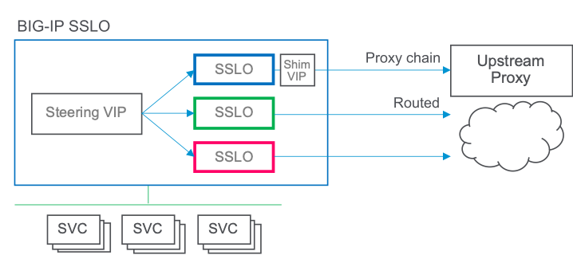

# F5 SSL Orchestrator Layered Architecture Configuration
# Transparent Proxy Configuration Use Cases
This section defines use cases specific to a transparent forward proxy implementation using the layered architecture

## Transparent to Explicit Proxy Egress:
In this scenario, clients egress through a transparent proxy solution but may need some traffic leaving SSL Orchestrator to flow through an upstream explicit proxy gateway. This requires special handling to convert the outbound routed traffic to an explicit proxy flow. The steps are as follows:

- Create a "client" iRule that will be attached to an SSL Orchestrator topology. This iRule will override normal outbound routing and force traffic to a "shim" virtual server.
- Create a "server" iRule that will attached to the shim virtual server. This iRule will handle the conversion of encrypted routed traffic to an explicit proxy communication.
- Create a "shim" virtual server that will sit between an SSL Orchestrator egress path and the upstream explicit proxy.



### Create the Client iRule
- Under Local Traffic -> iRules, click Create and import the **client-rule** under the **use-case-transparent-to-explicit-egress** folder.
- In the RULE_INIT section of the iRule, change the static::PROXY_CHAIN_VIP value to point to the shim virtual server name.


### Create the Server iRule
- Under Local Traffic -> iRules, click Create and import the **server-rule** under the **use-case-transparent-to-explicit-egress** folder.


### Create the upstream proxy pool
- Under Local Traffic -> Pools, create a pool that points to the upstream proxy resource.


### Create the Shim Virtual Server
- Under Local Traffic -> Virtual Servers, create a virtual server:
  - Source: 0.0.0.0/0
  - Destination: 0.0.0.0/0
  - Service Port: 0
  - HTTP Profile: http
  - VLAN: enabled and nothing selected
  - SNAT: enable as required to communicate with the upstream proxy
  - Address Translation: enabled
  - Port Translation: enabled
  - Pool: upstream proxy pool
  - iRule: Select the Server iRule


### Add the client rule to an SSL Orchestrator topology
- In the SSL Orchestrator UI, under the Interception Rules tab, select the "-in-t-" interception rule corresponding to the internal topology that requires explicit proxy egress. At the bottom of this page, select the **Client** iRule, then re-deploy.


### Create internal SSL Orchestrator topologies and configure the layered steering policy as required
- Using this Internal Layered Architecture design, create any number of internal SSL Orchestrator topologies. Example:
  - intercept_direct  (TLS intercept and routed egress)
  - intercept_proxy   (TLS intercept and upstream proxy egress)
  - bypass_direct     (TLS bypass and routed egress)
  - bypass_proxy      (TLS bypass and upstream proxy egress)
- Define the steering policy iRule to send traffic to one of the above topologies as required. Example:

```
when RULE_INIT {
    ## User-defined: DEBUG logging flag (1=on, 0=off)
    set static::SSLODEBUG 0

    ## User-defined: Default topology if no rules match (the topology name as defined in SSLO)
    set static::default_topology "intercept_proxy"

    ## User-defined: URL category list (create as many lists as required)
    set static::URLCAT_Finance_Health {
        /Common/Financial_Data_and_Services
        /Common/Health_and_Medicine
    }
}
when CLIENTSSL_CLIENTHELLO {

    ## set local sni variable (for logging)
    set sni ""

    ## Standard certificate Pinners bypass rule (specify your bypass topology)
    if { [call SSLOLIB::SNI CAT:/Common/sslo-urlCatPinners] } { call SSLOLIB::target "intercept_direct" ${sni} "pinners" ; return}

    ################################
    #### SNI CONDITIONS GO HERE ####
    ################################
    if { [call SSLOLIB::SNI CAT:$static::URLCAT_Finance_Health] } { call SSLOLIB::target "bypass_proxy" ${sni} "SNICAT" ; return }
}
```


